<div align="center">


# Pitch to Glory

**A football career, made your own.**

Create a teenage footballer, earn a trial at a semi-professional club and take them all the way to the Golden Ball — then retire into the Hall of Fame and carry on as their child. Free in your browser, and playable offline.

[](https://pitch-to-glory.pages.dev)

[](https://github.com/Lewandowskista/pitch-to-glory/actions/workflows/ci.yml)


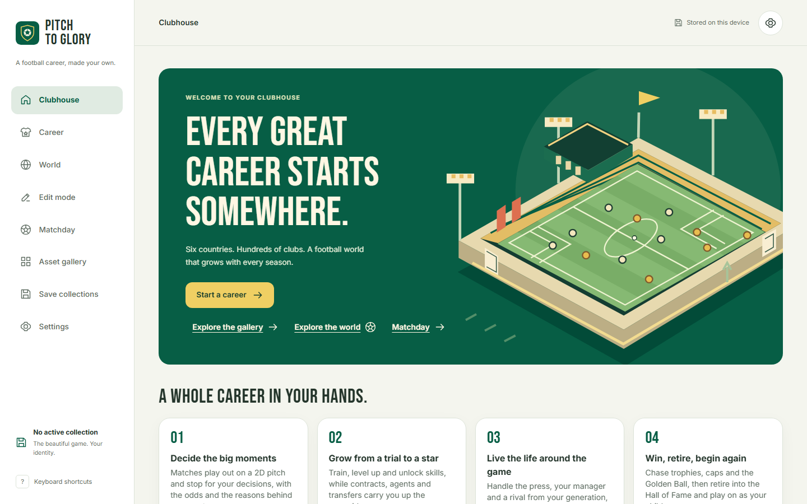

</div>

## The game

Matches play out on a 2D pitch and stop for **your** decisions. Every choice shows its chance of success and the attributes, traits and fatigue behind it, and every outcome is explained, so the game teaches its own systems.

<p align="center">
  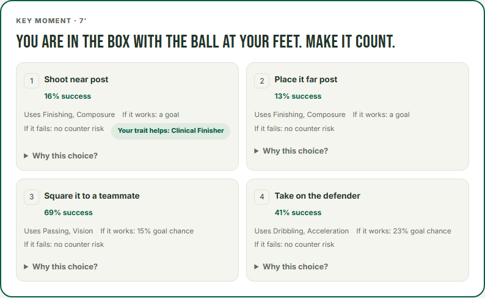
</p>

<table>
  <tr>
    <td width="50%">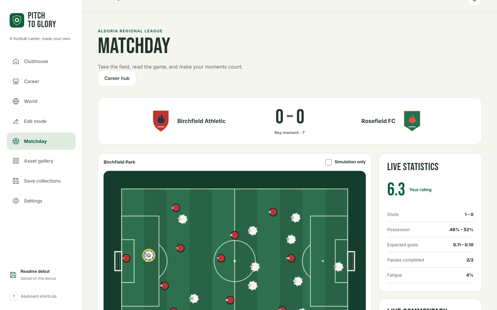</td>
    <td width="50%">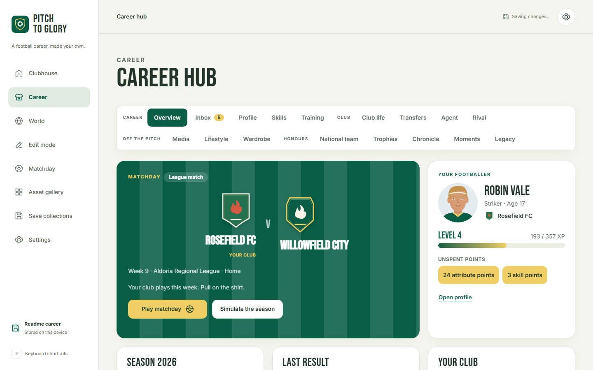</td>
  </tr>
  <tr>
    <td><b>Matchday.</b> Speed controls, live commentary, momentum and your live rating, with a pitch rendered by PixiJS (an SVG fallback covers every browser).</td>
    <td><b>Career hub.</b> Your next match, level and XP, unspent points, condition, training, fame, the press, your rival and the transfer market.</td>
  </tr>
  <tr>
    <td>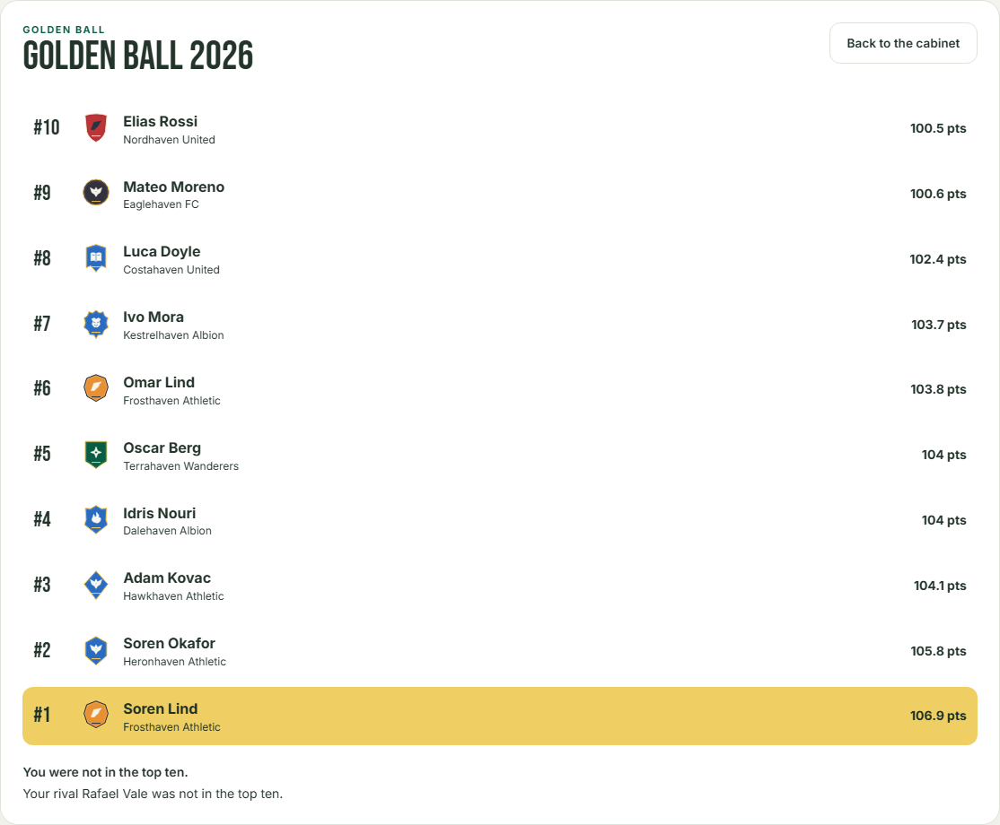</td>
    <td>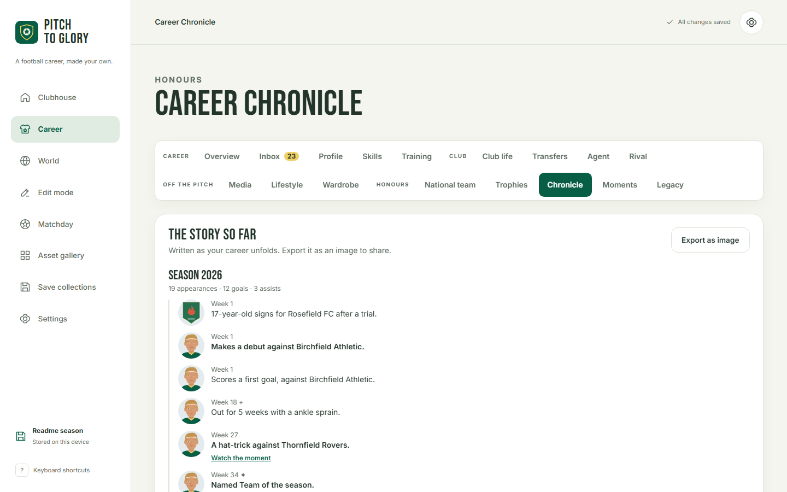</td>
  </tr>
  <tr>
    <td><b>Golden Ball.</b> Monthly and season awards, world records, and a ceremony that tells you where you and your rival finished.</td>
    <td><b>Career Chronicle.</b> Your career written as a biography as it happens, exportable as an image to share.</td>
  </tr>
  <tr>
    <td>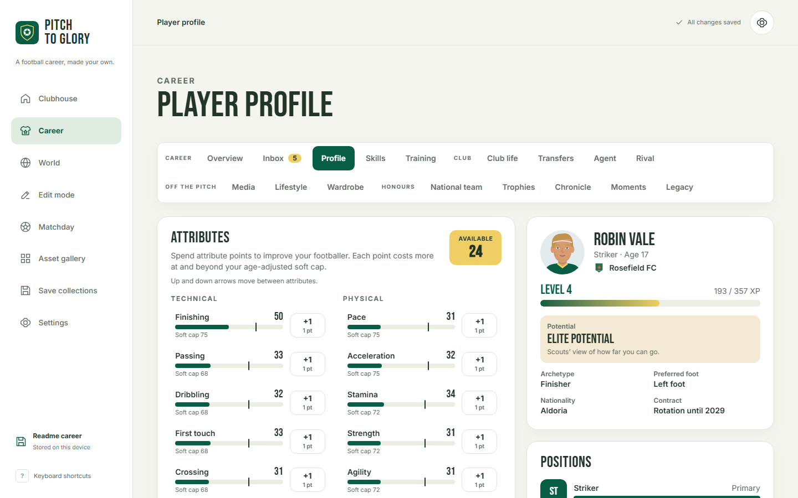</td>
    <td>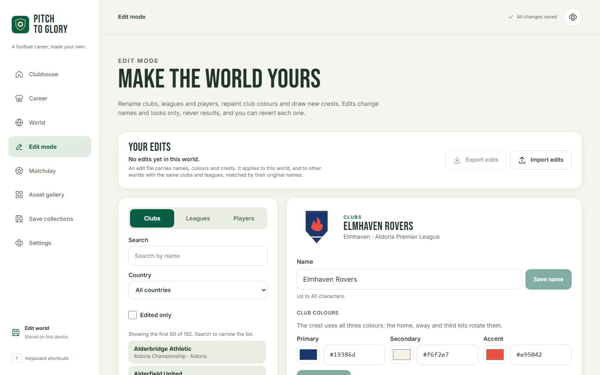</td>
  </tr>
  <tr>
    <td><b>Player profile.</b> 22 attributes with age-based soft caps, positions you can learn, and hidden traits revealed over time.</td>
    <td><b>Edit mode.</b> Rename and repaint the world; a kit clash check makes sure every kit is distinct for colour-blind players too.</td>
  </tr>
</table>

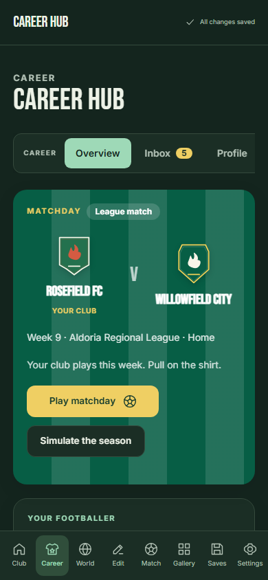

### What you can do

- **Play the moments that matter.** 6–15 key moments a match, depending on your role and form: chances in the box, build-up play, crosses, aerial duels, last-ditch defending and, for keepers, saves and distribution, each a situation drawn on the pitch. Half-time talks with the manager, substitutions and captain's calls.
- **Grow from a trial to a star.** XP from every match, attribute points against age-adjusted soft caps, a 49-skill tree that changes the odds and unlocks new choices, weekly training plans and injuries that need managing. Players peak in their late twenties; pace goes first, experience keeps rising.
- **Build a career off the pitch.** Contracts with role promises and clauses, agents, scouting interest, multi-step transfer negotiations and loans. Press conferences and a social feed, teammate chemistry, dressing-room groups, culture fit, and a rival from your generation tracked against you.
- **Live the life.** Fame levels, sponsors with obligations, cars, homes and investments, a wardrobe of boots, socks and armbands, signature celebrations that play on the pitch, and daily and weekly cosmetic challenges.
- **Win everything.** Domestic cups, a Champions Cup and a Shield with groups and knockouts, call-ups from Under-19 to senior level, tournaments every two years, and a Golden Ball ceremony.
- **Leave a legacy.** Retire into a Hall of Fame ranking, keep your Moments as replayable clips shared by link, and start again in the same world — former teammates may now be managers — or as your player's child.

### A living football world

Six real countries — England, France, Spain, Germany, Italy and Portugal — with their real league pyramids: **52 league groups, 959 clubs and 21,098 players**, every regional group and promotion or relegation playoff in the first four tiers, and deeper tiers where a semi-professional start needs them. Clubs and competitions are fictional parodies of their real counterparts, in real towns. Every club has its own procedural crest and three kits, every player a face that ages with them, and the whole world simulates every week in a Web Worker: results, transfers, manager sackings, retirements and youth intakes. See [national rules and sources](docs/REALISM.md).

### Made for every player

- **Accessible**: every screen checked with axe against WCAG 2.1 AA (no serious or critical issues) in light and dark themes; full keyboard play (Space, 1–4, arrows, Escape, `?`); screen-reader labels; text size from 85% to 130%; reduced motion; a simulation-only mode; colour-blind-safe kit choice.
- **Fast**: a startup bundle of 80 KB gzipped, with everything else loaded on demand. Mobile Lighthouse performance 86–95 and accessibility 100 on every audited page.
- **Yours**: no account, no ads, no tracking. Three save slots in your browser, backup export and import, and offline play after the first visit. All art is procedural SVG and every sound is synthesised on your device.
- **Guided**: a short tour during your first week and your first match.

<br clear="right" />

## How it is built

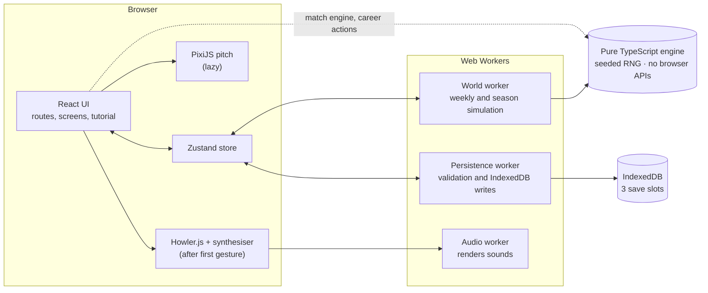

- **A pure engine.** Everything that decides results lives in `src/engine/`: plain, deterministic TypeScript with a seedable RNG and no browser globals or imports (enforced by lint). The same code runs in the UI, in Web Workers and in Node tests, so any career or match replays exactly from its seed.
- **Workers for heavy work.** Season simulation and save validation run off the main thread, with progress and cancellation, so the interface never freezes.
- **Saves you can trust.** Versioned save schema (now 13) with migrations from every earlier version, strict validation of every record, revision checks, and one browser tab per save slot.
- **Code-split by route.** Each screen is its own chunk; PixiJS, the save system, audio and animation features load only when needed.

### The match engine is calibrated

The match engine simulates 10,000 matches in its test suite and checks realistic averages: **2.74 goals per match**, a clear home advantage, and upsets that become rarer as the reputation gap grows.

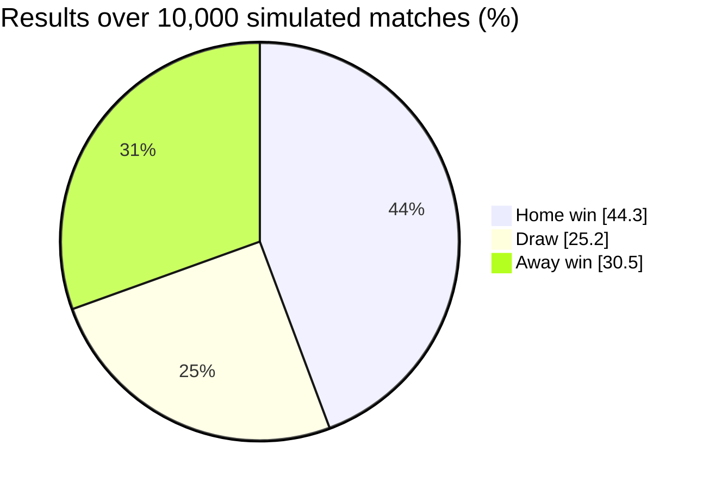

### Performance

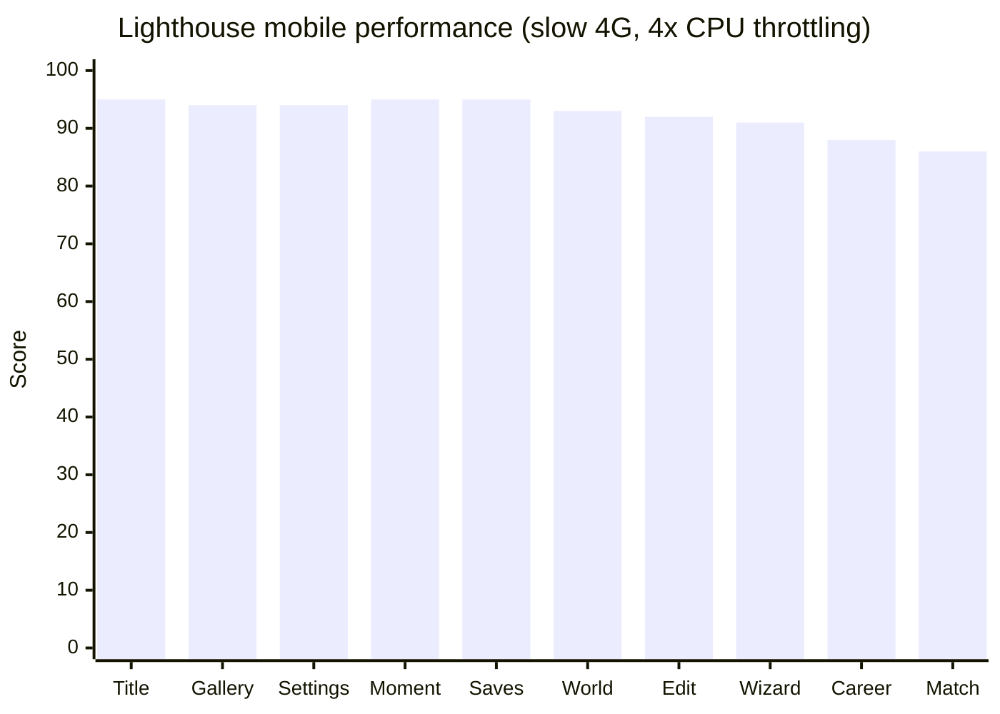

| Measure                                | Result                             |
| -------------------------------------- | ---------------------------------- |
| Startup JavaScript                     | 80 KB gzipped (was 173 KB)         |
| Largest route, including the shell     | 187 KB gzipped (budget 300 KB)     |
| Title page, mid-range phone on slow 4G | interactive in 2.8 s               |
| Desktop Lighthouse                     | performance 100, accessibility 100 |

### Delivery

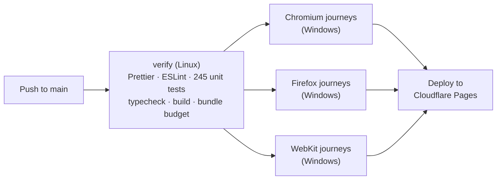

Every push to `main` is formatted, linted, unit-tested, type-checked and built, then played through in Chromium, Firefox and WebKit under the production security headers before it deploys. Pull requests run the same checks without deploying. Both GitHub Actions and Cloudflare Pages are free for this public repository. See [deploying](docs/DEPLOY.md).

## Tech stack

| Area               | Choice                                                                              |
| ------------------ | ----------------------------------------------------------------------------------- |
| Language and UI    | TypeScript (strict), React 18, React Router                                         |
| State              | Zustand slices over a framework-free engine                                         |
| Rendering          | PixiJS for the pitch, procedural SVG for crests, kits and faces                     |
| Styling and motion | Tailwind CSS with shared design tokens, Framer Motion                               |
| Storage            | IndexedDB via Dexie, versioned schema and migrations                                |
| Audio              | Howler.js playing sounds synthesised in a Web Worker                                |
| Testing            | Vitest for the engine, Playwright in Chromium, Firefox and WebKit, axe-core         |
| Delivery           | Vite, PWA with offline precache and update prompt, GitHub Actions, Cloudflare Pages |

## Run it locally

Node.js 22.19 or newer (Node 24 recommended):

```sh
npm ci
npm run dev          # http://127.0.0.1:5173
```

```sh
npm run typecheck
npm run lint
npm test             # Vitest: engine, persistence, workers, audio
npm run build        # typecheck, production build, per-route bundle budget
npx playwright install chromium firefox webkit
npm run test:e2e     # browser journeys under the production headers
npm run audit        # Lighthouse quality targets
```

On Windows PowerShell with blocked script shims, use `npm.cmd` and `npx.cmd`. Browser tests start a production preview on port 4173; Lighthouse uses 4180. After changing `public/share.svg` or the icons, run `npm run raster` to regenerate their PNG copies.

## Project layout

```text
src/
  engine/        pure, deterministic simulation: world, match, career, assets
  workers/       world simulation and persistence workers
  persistence/   save schema, validation, migrations, repositories (loaded on demand)
  audio/         synthesiser, rendering worker, Howler player
  store/         Zustand slices
  screens/       one lazy route per screen
  ui/            shell, tutorial, tooltip and shared components
  i18n/          every string, English first
  platform/      web adapter for files, sharing, storage and more
tests/           Vitest suites
e2e/             Playwright journeys and the accessibility sweep
docs/            architecture, decisions, balancing, verification, deployment
public/          icons, share card, production headers
```

## Roadmap

- [x] 1–3 · Foundations, a living world and the match engine
- [x] 4 · The career player: attributes, XP, training, skills and ageing
- [x] 5 · Contracts, agents, transfers, loans and negotiations
- [x] 6 · Media, relationships, the rival, the dressing room, morale and form
- [x] 7 · Fame, sponsors, lifestyle, wardrobe, celebrations and challenges
- [x] 8 · National teams, continental cups, awards, retirement, legacy, the Chronicle and Moments
- [x] 9 · Edit mode, accessibility, the tutorial, audio and polish
- [x] 10 · Web release: deployment, offline play, performance and share tags
- [ ] 11 · Android app with Capacitor

## Documentation

[Architecture](docs/ARCHITECTURE.md) · [Decisions](docs/DECISIONS.md) · [Balancing](docs/BALANCING.md) · [Match balancing](docs/MATCH-BALANCING.md) · [National rules and sources](docs/REALISM.md) · [Verification](docs/VERIFICATION.md) · [Deploying](docs/DEPLOY.md) · [Asset provenance](ASSETS.md) · [Implementation handoff](docs/HANDOFF.md)

Milestone write-ups: [match](docs/MILESTONE-3.md) · [career player](docs/MILESTONE-4.md) · [contracts and transfers](docs/MILESTONE-5.md) · [relationships and media](docs/MILESTONE-6.md) · [fame and lifestyle](docs/MILESTONE-7.md) · [honours and legacy](docs/MILESTONE-8.md) · [edit mode, accessibility, tutorial and audio](docs/MILESTONE-9.md) · [web release](docs/MILESTONE-10.md)

## Credits

All artwork is original procedural SVG made in this repository; every sound is synthesised in code. Fonts are self-hosted: [Inter](https://github.com/rsms/inter) and [Bebas Neue](https://github.com/dharmatype/Bebas-Neue), both under the SIL Open Font License. Audio playback uses [Howler.js](https://howlerjs.com) (MIT). Details in [ASSETS.md](ASSETS.md).
